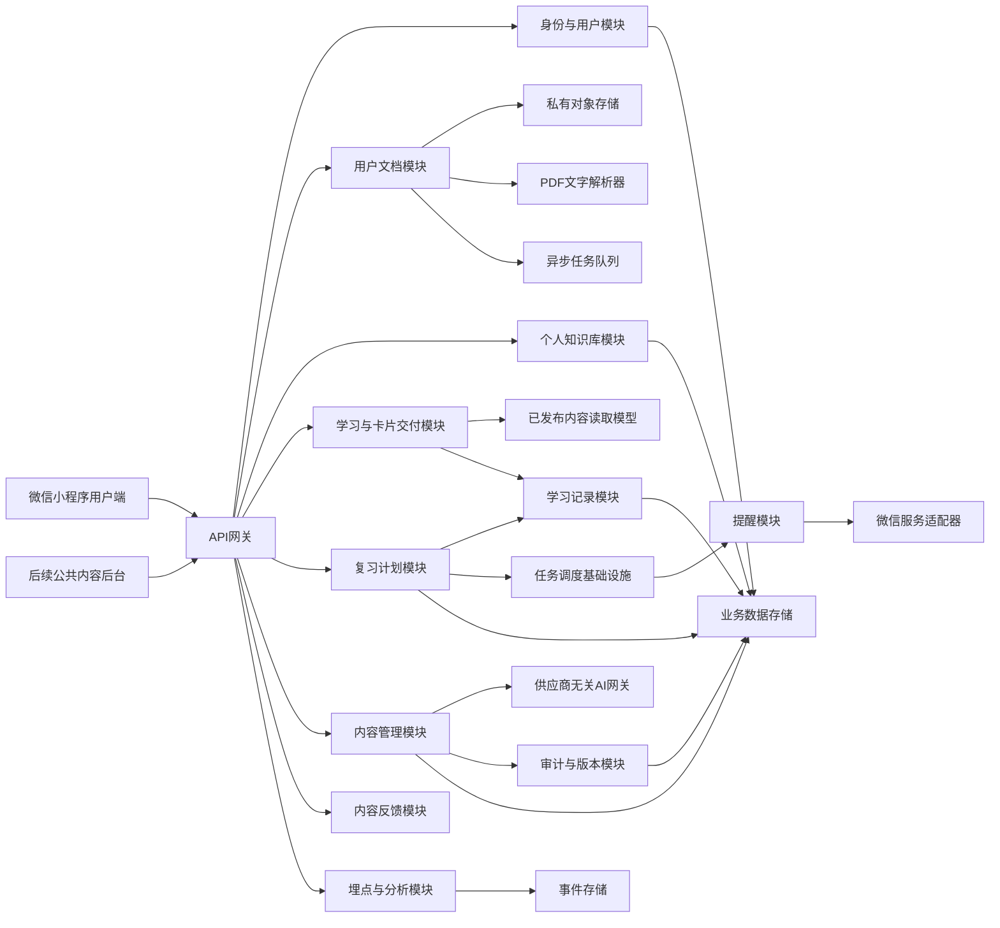
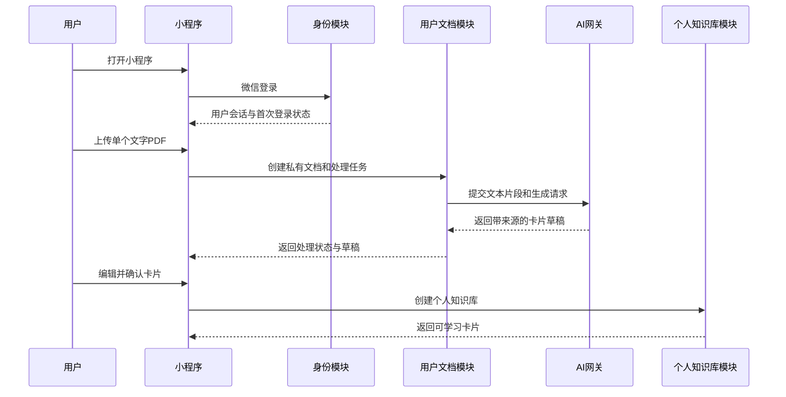
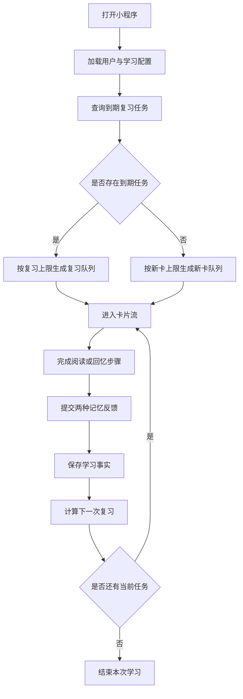
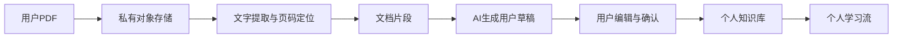
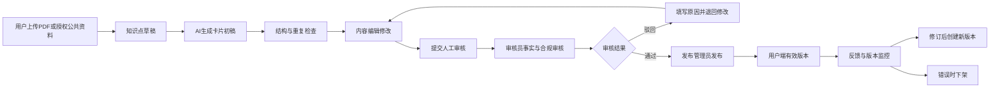
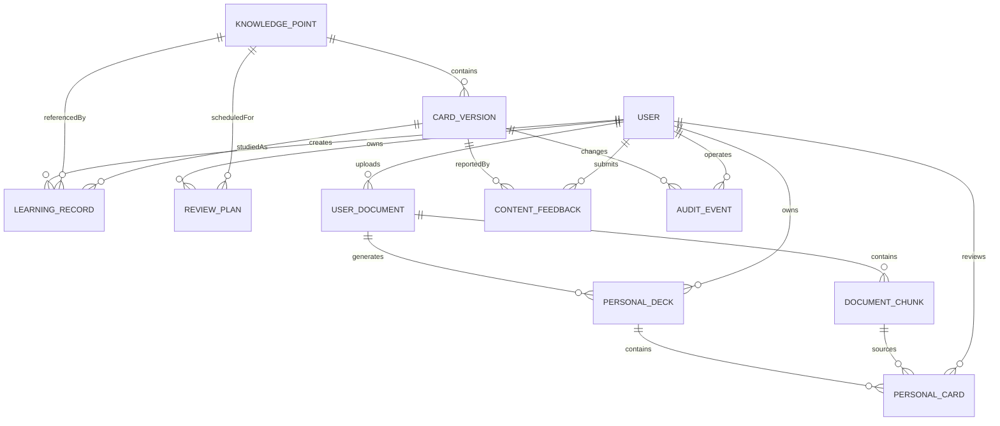

# CAPM 学习小程序模块划分与设计

## 1. 文档说明

### 1.1 目的

本文基于 [proposal.md](./proposal.md) 对用户 PDF 制卡学习小程序 MVP 进行模块划分，明确：

- 用户端、用户资料生产、后端领域模块和基础设施的职责边界；
- 模块之间的依赖方向、数据归属和关键接口边界；
- 学习、复习、内容生产和消息提醒的核心数据流；
- MVP 必须满足的业务约束、权限约束和非功能约束；
- 后续公共内容、多认证和商业化能力的扩展位置。

本文面向产品、设计、研发共同评审。当前仓库没有既有技术栈或服务目录，因此本文优先定义稳定的业务边界和技术无关的接口契约，不将具体云厂商、数据库或 AI 模型写死。

### 1.2 设计基线

- 产品形态：微信小程序。
- 首版内容来源：用户上传的单个、可复制文字的 PDF；CAPM 仅作为演示场景。
- 用户端核心体验：上传资料、审核卡片、进入个人知识库，并优先处理到期复习任务。
- 内容生产原则：AI 只能生成用户草稿，用户确认后才能进入个人学习流。
- 数据归属原则：原始 PDF、解析片段和个人卡片默认只属于上传用户，不进入公共内容池。
- AI 原则：先使用供应商无关的 Mock AI 适配器，真实供应商接入不改变草稿门禁。
- 复习策略：参考“不背单词”公开资料中“基于学习反馈动态调整复习间隔”的产品原则，采用透明、可配置、可替换的自有 MVP 规则，不复制其专有算法。

### 1.3 MVP 边界

MVP 包含：

- 微信登录和用户私有数据隔离；
- 新手引导、个人学习目标和订阅消息授权；
- 单个文字 PDF 上传、长期保存、删除和处理状态；
- PDF 文本提取、页码/章节来源追踪；
- AI 知识点拆解、卡片草稿和回忆题生成；
- 用户草稿查看、编辑、删除和批量确认；
- 个人知识库、知识卡流、上下滑动和两种记忆反馈；
- 复习计划、到期任务、逾期任务合并和每日学习量配置；
- 每日汇总复习提醒；
- 文档、卡片和学习事件的审计与基础分析。

不属于 MVP 验收范围：

- 扫描版 PDF、图片 OCR 和多个 PDF 合并；
- 用户内容公开创作、社区、评论、关注和排行榜；
- 付费订阅、课程商城和广告；
- 全量题库、模拟考试和复杂考试分析；
- 复杂推荐、搜索和社交裂变；
- AI 未经用户确认自动进入学习；
- 公共教研内容的完整运营后台。

未来能力可以复用本文中的考试、内容、用户目标和权限边界，但不应提前混入 MVP 的用户流程和验收条件。

## 2. 总体架构



### 2.1 分层原则

系统按以下方向组织依赖：

1. 用户端和后台只依赖 API 契约，不直接访问业务数据库。
2. API 网关负责认证、授权、参数校验、幂等键传递和统一错误格式，不承载学习或审核规则。
3. 领域模块负责业务规则和状态变更。
4. 基础设施负责存储、队列、定时任务、微信调用、AI 调用和日志，不反向决定领域状态。
5. 埋点通过领域事件接收业务事实，不通过读取数据库推断用户行为。
6. 已发布内容读取模型只暴露可投放版本，草稿、驳回、下架和历史版本不能进入用户端查询结果。

### 2.2 模块依赖约束

允许的主要依赖：

- 用户身份模块被所有需要用户上下文的模块依赖；
- 用户文档模块负责文件、解析片段和处理任务状态；
- 个人知识库模块负责用户确认后的私有卡片归属；
- 内容模块为公共卡片交付模块提供已发布内容；
- 学习记录模块接收学习和复习结果；
- 复习计划模块消费自评结果并生成下一次任务；
- 提醒模块消费到期任务和用户授权状态；
- AI 网关只被内容生产流程调用；
- PDF 解析器只被用户文档处理流程调用；
- 对象存储只通过文档模块访问；
- 审计与版本模块被内容状态变更和算法配置变更调用；
- 埋点模块接收各领域模块发出的业务事件。

禁止的依赖：

- 用户端绕过卡片交付模块读取内容数据库；
- 用户端不能绕过用户文档模块读取对象存储；
- 内容模块直接修改用户复习计划；
- AI 网关直接发布内容；
- AI 网关直接将草稿加入个人学习流；
- 消息适配器直接创建或修改复习任务；
- 埋点失败阻塞登录、学习记录或复习结果保存；
- 后台页面通过隐藏参数绕过角色权限；
- 历史卡片版本覆盖当前学习记录中的内容版本。

## 3. 模块总览

### 3.1 用户端模块

#### 3.1.1 授权与会话模块

职责：

- 发起微信登录；
- 创建或恢复用户学习档案；
- 保存会话状态；
- 处理授权拒绝、会话过期和重新登录；
- 向其他用户端模块提供当前用户身份。

不负责：

- 决定用户是否有权操作后台；
- 保存学习结果；
- 决定复习算法。

主要输入：

- 微信登录凭证；
- 当前设备和客户端版本信息。

主要输出：

- 用户会话；
- 用户首次登录状态；
- 用户隐私说明和授权状态摘要。

#### 3.1.2 新手引导模块

职责：

- 说明“短卡片 + 间隔复习”的产品价值；
- 确认 CAPM 学习目标；
- 解释“没记住”和“记住了”的含义；
- 引导用户选择订阅消息；
- 完成后进入学习入口。

关键约束：

- 引导不要求用户先完成复杂设置；
- 订阅消息拒绝不阻断学习；
- 引导完成应可重复查看，但重复进入不能重复创建用户档案或初始任务；
- 用户上传的文档是 MVP 的主要学习来源；CAPM 仅作为可选演示目标，界面和数据模型保留目标配置边界。

#### 3.1.3 文档导入模块

职责：

- 选择和上传单个 PDF；
- 展示文档列表、处理状态和失败原因；
- 查询解析和 AI 生成进度；
- 提供重试、查看草稿和删除文档入口；
- 只展示当前用户拥有的文档。

关键约束：

- 首版只接受可复制文字的 PDF；
- 上传和查询都必须经过服务端用户鉴权；
- 客户端不直接访问对象存储；
- 文档处理在异步任务中执行，页面离开不取消任务；
- 删除文档需要明确确认，并遵守关联卡片处理策略。

#### 3.1.4 个人知识库审核模块

职责：

- 展示 AI 生成的个人卡片草稿；
- 展示来源页码、章节和原文片段；
- 支持编辑、删除、逐张确认和批量确认；
- 展示生成失败、质量警告和重新生成入口；
- 将确认后的卡片交给个人卡片交付模块。

关键约束：

- 未确认卡片不能进入学习流；
- 用户只能审核自己的草稿；
- 用户确认不等同于公共内容发布；
- 批量确认必须支持幂等，不能重复创建学习卡。

#### 3.1.5 学习卡流模块

职责：

- 请求符合用户学习策略的卡片序列；
- 支持上滑下一张、下滑上一张；
- 上下滑动只将卡片加入待确认列表，左右滑动立即提交“没记住”并移除卡片；
- 当前学习组完成后，待确认列表中的卡片一次性提交“记住了”；
- 管理当前卡片、前后卡片和加载状态；
- 展示标题、结论、解释、例子、回忆提示、来源和版本；
- 识别阅读或回忆步骤完成；
- 提供结束本次学习操作。

关键约束：

- 卡片流不能直接返回未审核、未发布或已下架版本；
- 上下滑动只改变展示位置并维护待确认列表，不立即创建“记住了”学习记录；
- 同一张卡在一次学习组中只能进入待确认列表一次；
- 用户中途退出学习组时，待确认列表不提交；
- 一张卡的完成状态由服务端确认，客户端本地状态只能作为临时展示；
- 用户没有明确完成卡片和提交自评时，不得静默记账；
- 复杂知识点通过多个有序卡片表达，不能依赖一张卡承载完整教材章节。

#### 3.1.6 记忆反馈模块

职责：

- 展示“没记住”和“记住了”两种反馈；
- 在学习组完成时批量提交待确认的“记住了”结果；
- 解释两种反馈的判断标准；
- 提交自评结果；
- 展示轻量反馈；
- 支持修改或重新提交最近一次结果。

反馈含义：

- 没记住：无法稳定回忆核心内容，安排较短间隔后复习；
- 记住了：能够较完整地回忆核心内容，稳定回忆后逐步拉长间隔。

关键约束：

- 自评提交需要幂等；
- 修改结果必须产生可追踪的修正记录，并重新计算复习计划；
- 客户端重复点击不能产生多条等价的有效复习结果；
- 批量提交必须支持幂等，不能因重试重复增加连续记住次数；
- 自评结果必须关联用户、知识点、卡片版本、学习阶段和发生时间。

#### 3.1.7 复习任务模块

职责：

- 展示待复习任务数量和入口；
- 进入到期知识点对应的卡片；
- 按当前任务上下文启动复习；
- 显示因逾期合并后的复习任务；
- 在任务完成后返回下一项待处理任务或学习入口。

关键约束：

- 到期复习优先于新卡；
- 同一知识点在同一用户会话中不得被重复加入待复习队列；
- 逾期任务按知识点合并为当前一次复习，不要求用户补齐历史每个时间点；
- 复习任务为空时才允许默认进入新卡流。

#### 3.1.8 提醒设置模块

职责：

- 展示微信订阅消息授权状态；
- 发起订阅授权；
- 设置每日汇总提醒时间；
- 展示拒绝授权后的替代方案；
- 允许用户关闭提醒或重新授权。

默认策略：

- 每天发送一条到期复习汇总提醒；
- 默认时间为每天 20:00；
- 默认使用中国标准时间 UTC+8；
- 用户可以调整提醒时间；
- 发送前合并同一用户当日所有到期任务；
- 未授权用户仍可通过小程序内入口查看任务。

#### 3.1.9 内容反馈模块

职责：

- 提供错误、难懂、重复等反馈类型；
- 提交可选文字说明；
- 防止同一用户对同一卡片短时间重复提交相同反馈；
- 展示反馈提交结果；
- 允许用户撤回尚未处理的反馈（是否开放由产品策略配置）。

反馈不影响：

- 当前卡片学习完成状态；
- 当前自评结果；
- 复习计划计算。

### 3.2 后续公共内容管理后台模块

本模块不属于用户 PDF 制卡 MVP 的前置依赖。它服务于未来平台公共内容的编辑、教研审核和发布；用户上传的私有文档和个人卡片不进入此三角色流程。

#### 3.2.1 内容列表模块

职责：

- 按考试、领域、主题、状态、版本和负责人筛选；
- 展示草稿、待审核、已发布、已驳回、已下架状态；
- 展示来源、最近编辑人、审核人和更新时间；
- 进入编辑、审核、发布和版本详情。

#### 3.2.2 知识点与卡片编辑模块

职责：

- 创建和编辑知识点；
- 将知识点组织到考试、领域、主题和章节层级；
- 创建一张或多张关联卡片；
- 编辑标题、结论、解释、例子、回忆提示、参考答案和来源；
- 保存草稿；
- 预览移动端排版；
- 提交审核。

编辑规则：

- 每张卡必须关联一个明确知识点；
- 每张卡必须有来源和内容版本；
- 回忆题和参考答案必须成对保存；
- 发布版本内容不可直接覆盖，只能创建新版本；
- 任何结构性字段变更都应形成版本记录。

#### 3.2.3 AI 生成模块

职责：

- 接收已授权的结构化知识输入；
- 生成知识点拆解建议；
- 生成卡片初稿和回忆题；
- 执行重复、结构完整性和难度提示检查；
- 保存原始请求、模型响应摘要、使用的提示模板和结果版本；
- 将结果交给编辑继续修改。

边界：

- AI 结果只能进入草稿；
- AI 模块不能调用发布接口；
- AI 输出必须标记生成来源和模型配置版本；
- 发送给外部 AI 服务的数据必须经过敏感信息和版权范围检查；
- AI 服务不可用时，人工编辑流程仍然可用。

#### 3.2.4 审核模块

职责：

- 展示待审核卡片及其来源、历史版本和 AI 生成信息；
- 提交通过或驳回；
- 要求驳回时填写原因；
- 检查事实、术语、范围、版权、结构和考试适配性；
- 记录审核人、时间和审核意见。

审核通过不是发布本身。审核通过后仍需由发布管理员执行发布，避免审核和投放职责混淆。

#### 3.2.5 发布与下架模块

职责：

- 将审核通过版本发布为用户端可读版本；
- 下架当前版本；
- 恢复符合条件的历史版本；
- 记录发布、下架和恢复原因；
- 通知卡片读取模型刷新。

发布约束：

- 只有审核通过版本可以发布；
- 发布操作必须由发布管理员执行；
- 同一知识点同一时刻只能有一个用户端有效版本；
- 下架不删除用户历史学习记录；
- 下架后历史学习记录仍保留原卡片版本标识；
- 新版本发布后，既有复习计划默认继续关联知识点，但新展示内容使用有效版本；是否强制重新学习由复习策略配置决定。

#### 3.2.6 版本与来源模块

职责：

- 管理来源文档、来源定位和授权说明；
- 管理考试大纲版本；
- 管理卡片版本；
- 展示版本差异；
- 支持按来源批量标记待复审；
- 保留不可删除的审计链。

#### 3.2.7 内容反馈处理模块

职责：

- 聚合用户反馈；
- 按类型、卡片、版本、状态和严重程度筛选；
- 将反馈关联到待修订任务；
- 记录处理结论；
- 对错误内容触发下架或重新审核。

### 3.3 后端领域模块

#### 3.3.1 身份与用户模块

职责：

- 微信身份绑定；
- 用户档案创建和更新；
- 学习目标保存；
- 订阅消息授权状态管理；
- 会话和用户状态查询。

核心规则：

- 微信身份标识与内部用户 ID 分离；
- 用户删除或注销流程不得直接删除合规审计所需的匿名化记录；
- 用户档案不保存非必要的微信个人信息。

#### 3.3.2 考试内容目录模块

职责：

- 管理考试、考试大纲版本、领域、主题、章节和知识点；
- 维护知识点层级；
- 提供内容筛选和学习范围查询；
- 标识内容是否仍在当前考试大纲中。

MVP 数据边界：

- 用户文档不强制绑定某个考试；
- CAPM 公共目录作为可选演示内容保留；
- 数据模型保留考试维度；
- 新增考试或文档主题不应要求重写用户学习记录和复习计划。

#### 3.3.3 用户文档模块

职责：

- 创建和维护 `UserDocument`；
- 校验 PDF 类型、大小和上传用户；
- 管理对象存储引用和私有下载地址；
- 创建解析、分段和 AI 生成任务；
- 保存页码、章节和文本片段；
- 暴露文档状态和失败原因；
- 处理用户删除请求和关联数据归档。

关键约束：

- 文档所有权由服务端校验；
- 原始文件不提供公开永久 URL；
- 解析和生成任务必须可重试、可查询和幂等；
- 文档删除不能绕过审计和数据保留规则。

#### 3.3.4 个人知识库模块

职责：

- 创建 `PersonalDeck` 和 `DeckCard`；
- 管理用户草稿、审核和归档状态；
- 关联文档片段与卡片来源；
- 批量确认用户卡片；
- 为卡片交付模块提供用户私有可学习卡片。

关键约束：

- `USER_DRAFT` 不能被卡片交付模块读取；
- `USER_APPROVED` 只对所属用户有效；
- 用户确认不触发公共内容发布；
- 文档删除后按策略归档或移除关联个人卡片。

#### 3.3.5 卡片交付模块

职责：

- 按学习上下文查询可用卡片；
- 组装新卡和复习卡序列；
- 应用内容版本和投放状态过滤；
- 维护卡片顺序、前后关系和去重游标；
- 返回卡片展示所需的最小字段。

该模块是用户端唯一的卡片读取入口。它不负责保存自评结果，但要返回卡片版本和知识点 ID，供结果提交使用。

#### 3.3.6 学习记录模块

职责：

- 保存卡片展示、完成、回忆和自评事实；
- 区分新学、复习和重新学习阶段；
- 实现结果写入幂等；
- 提供用户学习历史查询；
- 发布学习完成和自评提交领域事件。

学习记录是事实记录，不直接覆盖历史。当前复习计划是可重新计算的派生状态。

#### 3.3.7 复习计划模块

职责：

- 为用户和知识点维护唯一当前复习状态；
- 根据自评结果计算下一次复习时间；
- 识别到期任务；
- 合并逾期任务；
- 应用每日新卡和复习上限；
- 记录算法版本和每次计算输入输出。

复习计划模块必须保证：

- 同一用户、同一知识点只有一个当前有效计划；
- 每次排期都可追溯到一条学习结果；
- 算法配置变更不会无记录地重写历史；
- 计算失败不应丢失已保存的自评结果；
- 时区计算使用明确的用户时区，默认 UTC+8。

#### 3.3.8 提醒模块

职责：

- 查询用户到期任务；
- 根据用户提醒设置生成每日汇总；
- 检查订阅授权状态；
- 创建发送任务；
- 记录微信发送请求、结果和失败原因；
- 防止同一用户同一日期重复发送汇总提醒。

提醒模块不改变复习计划的到期时间。消息发送失败只影响主动提醒，不影响小程序内任务展示。

#### 3.3.9 内容工作流模块

职责：

- 管理草稿、待审核、审核通过、驳回、已发布、已下架状态；
- 校验状态转换；
- 强制角色权限；
- 触发版本、审计、索引刷新和内容事件；
- 防止并发编辑覆盖。

#### 3.3.10 AI 网关模块

职责：

- 提供供应商无关的生成、检查和结构化输出接口；
- 管理模型和提示模板配置；
- 统一超时、重试、限流和错误格式；
- 记录成本和调用审计；
- 屏蔽具体供应商差异。
- 支持文档分段、知识点提取和批量卡片生成接口；
- 返回来源片段、页码、适配器版本和质量警告。

AI 网关不拥有业务内容发布权限，也不直接决定内容是否合格。

#### 3.3.11 内容反馈模块

职责：

- 接收用户反馈；
- 去重和限流；
- 关联卡片、知识点和内容版本；
- 提供后台处理状态；
- 在高严重度错误时发出内容复审事件。

#### 3.3.12 埋点与分析模块

职责：

- 接收关键业务事件；
- 记录事件时间、用户匿名标识、会话、客户端版本和内容版本；
- 提供激活、完成、复习留存、连续学习和反馈质量分析所需数据；
- 支持事件重放或失败补偿。

埋点分析不作为核心交易的同步依赖。事件写入失败时，应进入重试或补偿队列。

## 4. 复习计划设计

### 4.1 设计原则

MVP 采用一套可解释的规则，而不是直接实现外部产品的专有算法。规则满足：

- 没记住缩短间隔或回退阶段；
- 记住了在稳定回忆后逐步拉长间隔；
- 每次计算记录规则版本；
- 参数可配置，未来可使用真实学习数据调整；
- 规则引擎通过接口隔离，未来可以替换为成熟算法或数据模型。

### 4.2 推荐默认配置

以下是获得授权后为 MVP 定义的默认配置，最终实现应将其存入可版本化配置，而不是散落在代码常量中：

- 初始学习阶段的首次复习：10 分钟后；
- “没记住”：10 分钟后重新复习，并将稳定记忆阶段重置为 0；
- 首次“记住了”：3 天后复习；
- 连续“记住了”后的间隔：3、7、14、30、60 天；
- 达到 60 天后，继续按配置增长，但设置最大间隔上限；
- 逾期任务按知识点合并为当前一次复习，不逐个补齐错过的时间点；
- 复习完成后重新计算下一次时间，不按照原逾期时间连续追赶；
- 默认每日新卡上限为 10 张；
- 默认每日复习上限为 20 个知识点；
- 用户可以调整每日新卡上限、每日复习上限和提醒时间；
- 用户调整上限不删除已有复习计划，只改变当天任务选择。

这些数值是 MVP 默认参数，不应被视为学习效果结论。上线后应通过完成率、复习留存率、自评分布和长期回访数据验证。

### 4.3 复习状态

每个用户和知识点维护一条当前状态，建议包含：

- `userId`；
- `knowledgePointId`；
- `stage`：新建、学习中、巩固中、稳定、暂停；
- `nextReviewAt`；
- `lastReviewedAt`；
- `lastRating`；
- `consecutiveRemembered`；
- `intervalDays`；
- `algorithmVersion`；
- `updatedAt`。

历史每次复习另存为不可变的学习记录，不直接覆盖。

### 4.4 复习计算接口边界

```text
calculateNextReview(
  currentState,
  rating,
  reviewedAt,
  algorithmConfig
) -> nextState
```

接口输入必须包含：

- 计算前状态；
- 自评结果；
- 本次发生时间；
- 使用的算法配置版本。

接口输出必须包含：

- 下一状态；
- 下一次复习时间；
- 计算使用的版本；
- 可供审计的计算原因或规则命中信息。

保存流程应为：

1. 以幂等键保存自评事实；
2. 读取当前复习状态并校验版本；
3. 计算下一状态；
4. 以乐观锁更新当前计划；
5. 发布复习计划更新事件；
6. 返回下一次复习时间。

若第 4 步发生并发冲突，应重新读取最新状态并根据最新事实重算，不得静默覆盖其他复习结果。

## 5. 核心用户流程

### 5.1 首次使用与文档制卡流程



### 5.2 日常学习与复习优先流程



### 5.3 返回上一张卡

客户端可以维护有限的展示历史，但服务端应以以下规则处理：

- 首次展示、完成和自评分别有明确事件；
- 返回上一张只触发卡片展示状态，不触发完成事件；
- 已提交自评的卡片再次查看时显示历史结果；
- 用户重新自评时提交修正操作，而不是新增一条无来源的重复结果；
- 同一展示会话使用 `sessionId` 和卡片游标辅助去重。

## 6. 内容生产与发布流程

### 6.0 用户 PDF 私有制卡流程



用户 PDF 流程与公共内容发布流程隔离：

- 用户确认是个人卡片进入学习流的门禁；
- 公共内容仍需要编辑、审核员和发布管理员的独立流程；
- 用户私有卡片不会因为确认而进入公共 `PUBLISHED` 内容池。



### 6.1 内容状态机

公共内容使用以下状态机，服务于未来公共内容运营：

允许的状态：

- `DRAFT`：草稿；
- `IN_REVIEW`：待审核；
- `REJECTED`：已驳回；
- `APPROVED`：审核通过，等待发布；
- `PUBLISHED`：用户端有效；
- `UNPUBLISHED`：已下架；
- `ARCHIVED`：历史归档。

允许的主要转换：

- 草稿 -> 待审核；
- 待审核 -> 驳回；
- 待审核 -> 审核通过；
- 驳回 -> 草稿；
- 审核通过 -> 已发布；
- 已发布 -> 已下架；
- 已下架 -> 已发布；
- 旧版本 -> 历史归档。

所有转换必须记录：

- 操作人；
- 操作角色；
- 操作时间；
- 原状态和新状态；
- 原因或审核意见；
- 内容版本；
- 请求追踪 ID。

用户私有卡片使用独立状态机：

`USER_DRAFT → USER_REVIEWING → USER_APPROVED → IN_LEARNING → USER_ARCHIVED`

规则：

- AI 只能创建 `USER_DRAFT`；
- 只有卡片所属用户可以编辑、删除或确认；
- `USER_APPROVED` 只允许进入该用户的个人知识库；
- 用户确认不等于公共内容审核和发布；
- 用户文档删除时，关联卡片按产品删除策略归档或失效。

### 6.2 内容投放门禁

用户端卡片查询必须同时满足：

- 卡片状态为 `PUBLISHED`；
- 关联知识点属于有效考试和有效大纲范围；
- 版本没有被下架；
- 内容来源和审核信息完整；
- 卡片满足当前投放配置；
- 卡片未被内容安全规则阻断。

“审核通过”不是用户端查询条件的唯一来源；最终投放必须经过发布动作并刷新有效内容读取模型。

个人知识库使用另一套投放门禁：

- 卡片状态为 `USER_APPROVED` 或 `IN_LEARNING`；
- 卡片所属个人知识库属于当前用户；
- 来源文档未被删除或归档；
- 卡片来源片段和内容版本完整；
- 不经过公共 `PUBLISHED` 发布流程；
- 其他用户和公共内容读取模型不可见。

## 7. 角色与权限

### 7.1 后台角色

#### 内容编辑

可以：

- 创建和编辑知识点草稿；
- 创建和编辑卡片草稿；
- 录入来源；
- 触发 AI 生成；
- 查看自己的草稿和被退回内容；
- 提交审核。

不可以：

- 审核自己的内容；
- 发布或下架用户端内容；
- 修改已发布版本；
- 修改审计记录。

#### 审核员

可以：

- 查看待审核内容；
- 查看来源和历史版本；
- 通过或驳回内容；
- 填写审核意见；
- 将问题内容退回修改。

不可以：

- 直接修改原始发布版本；
- 绕过审核直接发布；
- 删除审核记录。

#### 发布管理员

可以：

- 发布审核通过版本；
- 下架和恢复内容；
- 查看发布影响范围；
- 处理紧急内容撤回。

不可以：

- 修改卡片正文；
- 将未审核版本直接发布；
- 删除历史版本和发布审计。

### 7.2 权限实现要求

- 权限在服务端校验，前端隐藏按钮不能替代权限控制；
- 内容编辑和审核员默认不可由同一操作链完成自审自发；
- 发布接口再次检查内容状态，不信任页面传入的角色或状态；
- 紧急下架可以独立于普通发布流程，但必须留下原因和审计；
- 权限变更应记录操作者、被授权人、角色和生效时间。

## 8. 数据模型与数据归属

### 8.1 核心对象

#### 用户对象

归属：身份与用户模块。

关键字段：

- 内部用户 ID；
- 微信身份关联标识；
- 学习目标；
- 订阅授权状态；
- 每日新卡上限；
- 每日复习上限；
- 提醒时间；
- 时区；
- 创建时间和最近活跃时间。

#### 用户文档对象

归属：用户文档模块。

关键字段：

- 文档 ID；
- 所属用户 ID；
- 原始文件名、类型、大小和 SHA-256；
- 私有对象存储引用；
- 页数；
- 处理状态和失败原因；
- 解析器版本；
- 创建、更新时间和删除时间。

#### 文档片段对象

归属：用户文档模块。

关键字段：

- 片段 ID；
- 文档 ID；
- 页码范围和章节标题；
- 提取文本；
- 顺序；
- 创建时间。

#### 个人知识库对象

归属：个人知识库模块。

关键字段：

- 知识库 ID；
- 所属用户 ID；
- 来源文档 ID；
- 名称和状态；
- 创建时间和更新时间。

#### 个人卡片对象

归属：个人知识库模块。

关键字段：

- 个人卡片 ID；
- 知识库 ID；
- 来源片段 ID；
- 用户审核状态；
- 标题、结论、解释、例子和回忆提示；
- 原文摘录、来源定位和 AI 适配器版本；
- 内容版本和更新时间。

#### 考试与大纲对象

归属：考试内容目录模块。

关键字段：

- 考试 ID；
- 考试名称；
- 大纲版本；
- 官方来源；
- 生效时间；
- 领域；
- 主题；
- 章节；
- 知识点。

#### 卡片与版本对象

归属：内容工作流和版本模块。

关键字段：

- 卡片 ID；
- 知识点 ID；
- 卡片版本；
- 标题、结论、解释、例子；
- 回忆提示和参考答案；
- 来源定位；
- 审核状态；
- 发布状态；
- 审核人和发布时间。

#### 学习记录对象

归属：学习记录模块。

关键字段：

- 学习记录 ID；
- 用户 ID；
- 卡片 ID；
- 知识点 ID；
- 卡片版本；
- 会话 ID；
- 学习阶段；
- 自评结果；
- 发生时间；
- 客户端版本；
- 幂等键。

#### 复习计划对象

归属：复习计划模块。

关键字段：

- 用户 ID；
- 知识点 ID；
- 当前阶段；
- 下一次复习时间；
- 最近一次复习结果；
- 连续记住次数；
- 当前间隔；
- 算法版本；
- 逾期状态；
- 更新时间；
- 乐观锁版本号。

#### 内容反馈对象

归属：内容反馈模块。

关键字段：

- 反馈 ID；
- 用户匿名标识；
- 卡片 ID；
- 内容版本；
- 反馈类型；
- 说明；
- 状态；
- 严重程度；
- 处理人；
- 处理结果。

#### 审计事件对象

归属：审计与版本模块。

关键字段：

- 事件 ID；
- 操作者；
- 角色；
- 对象类型和对象 ID；
- 原状态和新状态；
- 变更摘要；
- 请求追踪 ID；
- 发生时间。

### 8.2 数据关系



### 8.3 一致性规则

- 学习记录一旦确认写入不可修改，修正通过新记录或修正记录表达；
- 复习计划是当前状态，必须可以从历史学习记录和算法版本追溯；
- 卡片版本不可复用其他卡片的版本 ID；
- 已发布版本的来源、审核和发布信息不可为空；
- 用户文档、文档片段、个人知识库和个人卡片的查询必须按所属用户隔离；
- `USER_DRAFT` 和 `USER_REVIEWING` 卡片不得进入个人学习入口；
- 个人卡片确认后只能被所属用户读取，不能自动进入公共内容读取模型；
- 删除用户文档时，必须明确处理原文件、片段、草稿、已确认卡片和学习记录；
- 用户删除请求与审计留存策略必须分别处理；
- 关键业务写入和领域事件之间采用可靠投递机制，避免“状态已更新但事件丢失”。

## 9. 关键接口边界

以下为业务能力边界，不限定 HTTP、RPC 或具体框架。

### 9.1 用户端接口

- `createSession`：创建或恢复用户会话；
- `completeOnboarding`：保存引导完成和学习目标；
- `uploadDocument`：上传单个 PDF 并创建用户私有文档；
- `listMyDocuments`：列出当前用户自己的文档；
- `getDocument`：读取文档状态、处理进度和失败原因；
- `retryDocument`：重试失败的解析或生成任务；
- `deleteDocument`：删除文档及按策略处理派生卡片；
- `getDocumentDrafts`：读取文档生成的用户卡片草稿；
- `updateDraftCard`：编辑用户卡片草稿；
- `archiveDraftCard`：删除或归档用户卡片草稿；
- `approveDraftCards`：批量确认用户卡片；
- `getMyDecks`：读取当前用户的个人知识库；
- `getDeckLearningEntry`：返回个人知识库的复习优先/新卡入口；
- `getLearningEntry`：返回复习优先或新卡入口；
- `getCardSequence`：按学习上下文获取卡片序列；
- `completeCard`：确认卡片完成；
- `submitRating`：提交或修正记忆反馈；
- `submitRememberedBatch`：学习组完成后批量提交“记住了”结果；
- `getDueReviews`：查询到期复习任务；
- `getStudySettings`：读取每日学习量和提醒设置；
- `updateStudySettings`：更新每日新卡、复习上限和提醒时间；
- `requestSubscription`：记录订阅授权结果；
- `submitContentFeedback`：提交卡片反馈。

### 9.2 后台接口

以下接口用于未来公共内容运营，不用于用户私有 PDF 卡片的确认：

- `listContent`;
- `createKnowledgePoint`;
- `createCardDraft`;
- `updateCardDraft`;
- `generateCardDraft`;
- `runContentCheck`;
- `submitForReview`;
- `approveContent`;
- `rejectContent`;
- `publishContent`;
- `unpublishContent`;
- `restoreContent`;
- `listVersions`;
- `listAuditEvents`;
- `listContentFeedback`;
- `resolveContentFeedback`。

### 9.3 接口通用要求

- 需要修改状态的接口支持幂等键；
- 返回统一的业务错误码和用户可理解的提示；
- 返回内容时携带对象 ID、版本 ID和更新时间；
- 需要权限的接口返回授权失败而不是空数据；
- 所有写接口带请求追踪 ID；
- 分页接口使用稳定排序；
- 用户端接口不返回后台审核意见、敏感 AI 原始响应或不必要的来源内部信息。

## 10. 任务、消息与基础设施

### 10.1 定时任务

至少需要以下任务：

- 用户 PDF 文字提取；
- 文档分段和页码定位；
- AI 知识点提取；
- AI 卡片批量生成；
- 草稿质量检查；
- 到期复习任务索引刷新；
- 每日提醒汇总生成；
- 微信订阅消息发送；
- 失败消息重试；
- 内容有效性和大纲版本核验提醒；
- 反馈超时处理提醒；
- 埋点补偿和归档。

任务要求：

- 任务可重试；
- 任务执行有幂等键；
- 任务失败有告警；
- 任务状态可查询；
- 不因消息任务失败修改学习计划；
- 用户所在时区和默认 UTC+8 规则明确记录。

### 10.2 缓存与读取模型

可以使用缓存或独立读取模型优化卡片流，但必须满足：

- 缓存只保存可投放内容；
- 发布和下架操作触发失效或刷新；
- 缓存不可成为审核状态的唯一事实来源；
- 用户复习计划和自评结果不依赖卡片缓存写入；
- 缓存过期时可以回源到权威数据。

### 10.3 队列与事件

适合异步化的任务：

- PDF 上传后的解析和文本提取；
- 文档片段生成；
- 用户文档的 AI 知识点和卡片生成；
- 学习事件分析；
- 复习计划更新后的提醒候选刷新；
- AI 生成和内容检查；
- 内容发布后的读取模型刷新；
- 微信消息发送；
- 内容反馈聚合。

必须同步完成的最小事务：

- 文档元数据和处理任务创建；
- 用户卡片确认和个人知识库关联；
- 自评事实保存；
- 当前复习计划更新；
- 内容状态转换的权限和状态校验；
- 发布门禁校验和发布审计。

### 10.4 文件与持久化基础设施

用户 PDF 需要独立于业务数据库保存：

- 原始文件放入私有对象存储；
- 数据库保存文件元数据、哈希、所有权和处理状态；
- 文本片段保存页码、章节和顺序；
- 下载通过短时授权地址完成；
- 对象存储、数据库和任务队列都需要可重试和可观测；
- 当前仓库的内存仓储和微信本地 Mock 不能作为长期生产存储。

## 11. 隐私、安全与可追溯性

### 11.1 隐私

- 只收集登录、学习、提醒和产品分析所需数据；
- 微信身份标识与内部用户 ID 分离；
- 展示分析时使用匿名或聚合标识；
- AI 调用前检查输入中是否含不必要的个人信息；
- 原始 PDF、提取文本和个人卡片默认只对所属用户可见；
- 用户文档不进入公共内容池，也不默认用于 AI 供应商训练；
- AI 供应商接入前必须确认数据保留、训练使用和跨境处理策略；
- 文件下载使用短时授权地址，不能暴露永久公开链接；
- 文档访问、下载、解析、生成、编辑、确认和删除必须可审计；
- 提供隐私说明、数据用途和订阅消息说明；
- 用户拒绝订阅不影响小程序内复习；
- 对数据导出、注销和删除请求定义处理流程。

### 11.2 内容安全

- AI 输出默认不可信；
- 人工审核是发布前强制门禁；
- 版权来源、授权范围和使用版本可追溯；
- 错误内容支持紧急下架；
- 审核和发布操作不可静默修改；
- 内容版本变更触发必要的复审。

### 11.3 操作审计

下列操作必须审计：

- 登录身份绑定和管理员权限变更；
- 内容创建、修改、提交审核；
- 审核通过、驳回；
- 发布、下架、恢复；
- AI 调用和配置变更；
- 复习算法配置变更；
- 用户提醒设置变更；
- 内容反馈处理。
- 用户文档上传、下载、解析、生成、编辑、确认和删除；

## 12. 埋点与可观测性

### 12.1 核心事件

用户端事件：

- `app_opened`；
- `login_succeeded`；
- `onboarding_completed`；
- `learning_entry_opened`；
- `card_displayed`；
- `card_completed`；
- `card_swiped_next`；
- `card_swiped_previous`；
- `rating_submitted`；
- `rating_corrected`；
- `review_entered`；
- `review_completed`；
- `subscription_authorized`；
- `subscription_rejected`；
- `reminder_clicked`；
- `content_feedback_submitted`。

后台事件：

- `content_draft_created`；
- `ai_generation_requested`；
- `ai_generation_completed`；
- `content_submitted_for_review`；
- `content_approved`；
- `content_rejected`；
- `content_published`；
- `content_unpublished`；
- `content_feedback_resolved`。

### 12.2 事件公共字段

- 事件 ID；
- 事件名称；
- 发生时间；
- 匿名用户 ID；
- 会话 ID；
- 客户端版本；
- 平台；
- 内容 ID；
- 内容版本；
- 知识点 ID；
- 请求追踪 ID。

### 12.3 指标映射

- 首次激活率：登录成功、引导完成、第一张卡展示；
- 知识点完成率：知识点开始、卡片完成和流程完成；
- 复习留存率：生成到期任务、进入复习、完成复习；
- 连续学习行为：单次会话连续完成卡片数量；
- 内容质量反馈：反馈按卡片版本、反馈类型和发布批次聚合。

## 13. 非功能设计

### 13.1 性能

- 卡片流提前加载下一张和必要的上一张；
- 卡片切换不依赖每次滑动都重新请求完整用户状态；
- 自评提交优先保证快速反馈，同时可靠保存服务端结果；
- 到期任务查询使用索引或读取模型；
- AI 生成和内容检查采用异步任务，后台显示任务状态。

### 13.2 稳定性

- 自评结果使用幂等键和重试；
- 网络波动时客户端暂存待提交结果，但最终以服务端确认状态为准；
- 重试不得造成重复学习记录或重复消息；
- 失败操作返回可理解的提示和可恢复动作；
- 核心写入、队列投递和消息发送有监控。

### 13.3 可读性与可访问性

- 适配常见手机纵向屏幕；
- 允许系统字体设置影响正文布局；
- 公式、关键词和引用来源清晰可读；
- 状态不只依靠颜色表达；
- 触控区域和滑动反馈清晰；
- 自评选项文字和含义同时展示。

## 14. 扩展边界

### 14.1 多认证

已经预留：

- 考试 ID和大纲版本；
- 内容目录按考试隔离；
- 用户学习目标；
- 复习计划按知识点关联；
- 卡片投放按考试过滤。

未来新增认证时，应新增考试配置和内容，不应复制整套用户、学习记录或复习计划模块。

### 14.2 商业化

未来可以在 API 网关和用户权益模块之间加入订阅、套餐和支付能力，但 MVP 不应让付费状态影响核心学习记录模型。

### 14.3 算法演进

复习算法可以从规则引擎演进到：

- 成熟的通用间隔重复算法；
- 基于用户学习记录的记忆状态模型；
- 按内容难度和用户反馈调整的调度器。

演进要求：

- 保留算法版本；
- 新旧规则可对比；
- 支持灰度；
- 可以回放历史学习记录；
- 不直接删除旧规则产生的排期依据。

## 15. MVP 验收映射

### 用户端

- 新用户可以完成登录、引导并上传一个文字 PDF；
- 用户可以查看文档处理进度和失败原因；
- AI 可以生成带来源页码的用户卡片草稿；
- 用户可以编辑、删除和批量确认自己的卡片；
- 未确认卡片不会进入个人学习流；
- 确认后的卡片只对所属用户可见，并能进入学习和复习；
- 可以上下滑动，返回上一张不会重复记账；
- 左右滑动的卡片立即提交“没记住”，整组完成后批量提交剩余卡片的“记住了”；
- 自评可修改并留下修正记录；
- 系统生成可查询的下一次复习时间；
- 到期复习优先展示；
- 逾期任务按知识点合并；
- 订阅消息授权后可以收到每日汇总提醒；
- 拒绝订阅不影响小程序内复习；
- 用户可以提交内容问题反馈。

### 公共内容后台

- 编辑可以创建、编辑和提交草稿；
- AI 可以生成卡片草稿和回忆题；
- 审核员可以通过或驳回并填写原因；
- 发布管理员可以发布、下架和恢复；
- 未审核内容不会出现在用户端；
- 已发布内容包含来源和版本；
- 可以查看版本和审核记录；
- 可以处理内容反馈。

公共内容后台不是用户 PDF 制卡 MVP 的前置依赖。

### 运营与技术

- 关键学习事件能够被记录；
- 复习算法配置和版本可追踪；
- 微信消息发送失败不影响小程序内任务；
- 内容发布、下架、权限变更和算法变更有审计；
- 网络波动和重复请求不会造成自评结果丢失或重复记账。

## 16. 实施顺序建议

1. 确认 PDF 大小、页数、存储和删除策略。
2. 定义用户文档、文档片段、个人知识库、个人卡片和学习记录数据契约。
3. 定义上传、解析、AI 生成、用户审核和失败重试状态机。
4. 在 `KnowledgeCardApplication` 外包 HTTP 层，提供用户文档和草稿接口。
5. 接入私有对象存储、PDF 文字解析器、数据库和异步任务队列。
6. 接入供应商无关 AI 网关，开发阶段使用 Mock AI，结果只能进入用户草稿。
7. 将已确认个人卡片接入现有学习和间隔复习模块。
8. 实现文档来源追踪、权限隔离、删除和审计。
9. 再建设公共教研内容后台和 CAPM 公共内容运营。

