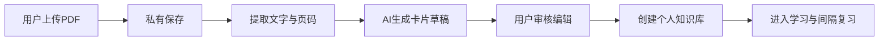
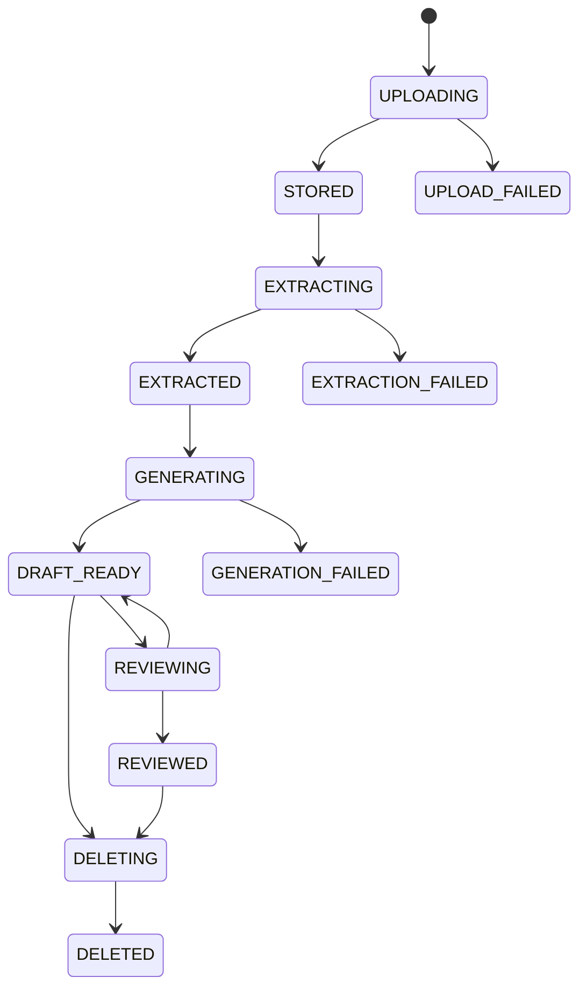
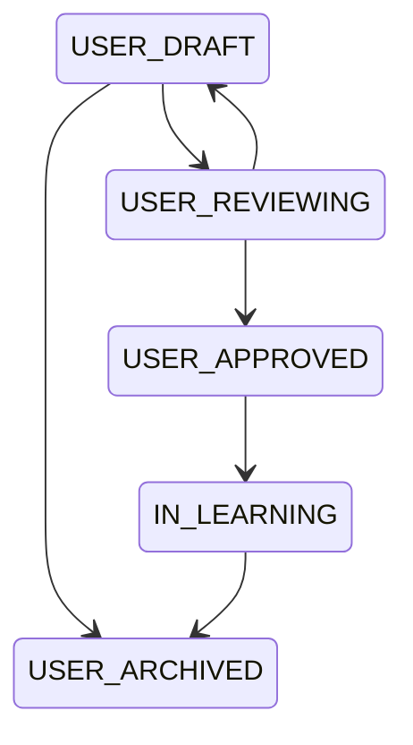

# 用户 PDF 制卡流程设计

> 文档状态：MVP 技术方案  
> 版本：v0.1  
> 更新时间：2026-07-14  
> 适用范围：用户上传单个、包含可复制文字的 PDF，由 AI 生成私有卡片草稿，用户确认后进入学习

## 1. 目标与边界

### 1.1 目标

建立一条完整的个人资料制卡链路：



### 1.2 首版范围

- 一次上传一个 PDF。
- 只支持包含可复制文字的 PDF。
- 原始 PDF 长期保存，默认仅上传用户可见。
- 保存文本片段、页码和章节定位，支持卡片来源追溯。
- AI 生成多个知识点和卡片草稿。
- 用户可以逐张或批量编辑、删除、确认草稿。
- 只有确认后的卡片才能进入个人学习流。
- 复用现有卡片流、学习记录和间隔复习能力。

### 1.3 暂不支持

- 扫描版 PDF、图片 OCR 和手写内容识别。
- 多个 PDF 合并生成同一个知识库。
- 用户文档进入公共内容库。
- AI 生成后自动进入学习。
- 复杂的在线 PDF 编辑器和全文协作。

## 2. 用户流程

### 2.1 上传流程

1. 用户进入“我的资料”。
2. 用户选择一个 PDF 文件。
3. 客户端在上传前检查文件类型和已知大小限制。
4. 用户确认隐私说明和上传操作。
5. 客户端将文件上传到后端。
6. 后端创建用户私有文档记录和处理任务。
7. 客户端展示上传和处理状态，用户可以离开页面后再回来查看。

### 2.2 解析与生成流程

1. 文件保存成功后进入 `STORED`。
2. 解析任务读取 PDF 的文字层，按页提取文字。
3. 系统保存页码、章节标题和文本片段。
4. 分段器将长文本切分为带上下文的生成单元。
5. AI 从文本片段中提取知识点、主题和关键词。
6. AI 为知识点生成卡片草稿和回忆提示。
7. 系统保存来源页码、原文片段、AI 适配器版本和生成时间。
8. 所有草稿生成后进入 `DRAFT_READY`。

### 2.3 用户审核流程

1. 用户打开文档的草稿列表。
2. 用户查看卡片内容、来源页码和原文片段。
3. 用户可以修改标题、结论、解释、例子和回忆提示。
4. 用户可以删除错误、重复或不需要的卡片。
5. 用户可以确认单张卡片或批量确认。
6. 确认后的卡片进入个人知识库。
7. 用户点击“开始学习”，进入现有学习卡流。

### 2.4 删除流程

1. 用户在资料页选择删除 PDF。
2. 系统明确提示删除范围：原 PDF、解析片段、未确认草稿和来源关联。
3. 用户确认后，文档进入删除状态。
4. 原文件、片段和未确认草稿不可再访问。
5. 已确认卡片和学习记录是否保留，遵循产品最终确认的删除策略；首版默认一并归档并停止后续学习。

## 3. 文档状态机



状态约束：

- `UPLOAD_FAILED`、`EXTRACTION_FAILED` 和 `GENERATION_FAILED` 必须保存可理解的失败原因。
- 失败任务支持重试，重试不能重复创建同一文档。
- `DRAFT_READY` 以前的卡片不能进入学习流。
- `REVIEWED` 表示至少有一张卡片已被用户确认，不代表文档内容经过平台教研审核。
- 已删除文档不能通过旧链接访问文件或卡片。

## 4. 卡片状态机



- `USER_DRAFT`：AI 生成、用户尚未确认。
- `USER_REVIEWING`：用户正在查看或编辑。
- `USER_APPROVED`：用户确认，可以进入个人学习流。
- `IN_LEARNING`：已有学习或复习记录。
- `USER_ARCHIVED`：用户删除、归档或来源文档被删除。

## 5. 核心数据对象

### 5.1 UserDocument

- `id`
- `owner_user_id`
- `original_filename`
- `mime_type`
- `size_bytes`
- `sha256`
- `storage_key`
- `page_count`
- `status`
- `status_reason`
- `parser_version`
- `created_at`
- `updated_at`
- `deleted_at`

### 5.2 DocumentChunk

- `id`
- `document_id`
- `page_start`
- `page_end`
- `section_title`
- `text`
- `sequence`
- `created_at`

### 5.3 PersonalDeck

- `id`
- `owner_user_id`
- `document_id`
- `name`
- `status`
- `created_at`
- `updated_at`

### 5.4 DeckCard

- `id`
- `deck_id`
- `source_chunk_id`
- `status`
- `title`
- `conclusion`
- `explanation`
- `example`
- `recall_prompt`
- `reference_answer`
- `source_locator`
- `source_excerpt`
- `ai_adapter_version`
- `content_version`
- `created_at`
- `updated_at`

权限原则：所有 `UserDocument`、`DocumentChunk`、`PersonalDeck` 和 `DeckCard` 查询都必须带当前用户身份过滤，不能依赖客户端传入的 owner ID。

## 6. API 契约草案

以下是业务能力边界，不限定 HTTP、RPC 或具体框架。

### 6.1 文档接口

- `uploadDocument(file, metadata)`：上传单个 PDF，返回文档 ID和初始状态。
- `getDocument(documentId)`：读取当前用户自己的文档状态和基础信息。
- `listMyDocuments()`：列出当前用户的私有文档。
- `retryDocument(documentId)`：重试失败的解析或生成任务。
- `deleteDocument(documentId)`：删除文档及其未确认派生内容。

### 6.2 草稿与知识库接口

- `getDocumentDrafts(documentId)`：返回文档生成的用户草稿。
- `updateDraftCard(cardId, patch)`：编辑草稿内容。
- `archiveDraftCard(cardId)`：删除或归档草稿。
- `approveDraftCards(cardIds)`：批量确认卡片。
- `getMyDecks()`：返回当前用户的个人知识库。
- `getDeckLearningEntry(deckId)`：返回个人知识库中的复习优先/新卡入口。

### 6.3 任务接口

- `getDocumentTaskStatus(documentId)`：返回解析和生成进度。
- `cancelDocumentTask(documentId)`：在任务允许取消时停止处理。

所有写入接口需要支持幂等键；客户端重复点击或网络重试不能重复创建文件、草稿或确认记录。

## 7. AI 适配器设计

首版先定义稳定接口，开发阶段使用 Mock AI，之后替换真实供应商：

```text
extract_knowledge_points(chunks, context) -> KnowledgePointSuggestion[]
generate_card_drafts(knowledge_points, chunks, context) -> CardDraft[]
check_card_drafts(card_drafts, source_chunks) -> QualityWarning[]
```

AI 输出至少需要包含：

- 知识点标题和目标。
- 卡片标题、结论、解释、例子和回忆提示。
- 对应来源片段 ID、页码和原文摘录。
- AI 适配器版本。
- 质量警告，如来源不足、重复、内容过长或可能存在冲突。

AI 适配器不得直接执行以下操作：

- 将卡片状态改为 `USER_APPROVED`。
- 将卡片加入用户学习队列。
- 访问其他用户的文档。
- 默认保留用户文档用于供应商训练。

## 8. 任务、进度与失败处理

文档处理应采用异步任务，不要求用户一直停留在上传页面。推荐拆分为：

1. 文件保存任务。
2. PDF 文字提取任务。
3. 文档分段任务。
4. 知识点提取任务。
5. 卡片批量生成任务。
6. 草稿质量检查任务。

进度至少包含：

- 当前状态。
- 已处理页数/总页数（解析阶段）。
- 已生成卡片数/预计数量（生成阶段）。
- 最近更新时间。
- 失败原因和是否可以重试。

典型失败处理：

| 场景 | 用户反馈 | 系统处理 |
| --- | --- | --- |
| 文件类型不支持 | 说明只支持文字 PDF | 上传前拦截 |
| 文件损坏 | 无法读取文件 | 标记上传或解析失败 |
| PDF 无文字层 | 当前版本无法识别 | 提示暂不支持 OCR |
| 文本过少 | 无法生成可靠卡片 | 允许用户删除或重新上传 |
| AI 超时 | 正在重试或稍后查看 | 异步重试并保持草稿幂等 |
| AI 结果为空 | 未生成可用卡片 | 标记生成失败并允许重试 |
| 用户重复提交 | 不重复创建任务 | 通过幂等键返回原任务 |

## 9. 隐私、安全与合规

- 原始 PDF 和提取文本默认只对上传用户可见。
- 下载文件时使用鉴权后的短时访问地址，不能暴露永久公开 URL。
- 服务端校验文档所有权，不能信任客户端传入的用户 ID。
- 记录文档访问、下载、解析、生成、编辑、确认和删除审计事件。
- 默认不把用户文档用于 AI 供应商训练；真实供应商接入前必须确认数据保留策略。
- 删除操作需要二次确认，并定义对象存储、数据库和备份中的删除范围。
- 日志中不得记录完整 PDF 内容或完整原文片段，避免敏感资料泄露。
- 需要在用户协议和隐私说明中说明：用户应对上传资料拥有合法使用权。

## 10. 验收标准

- 用户可以上传一个文字 PDF，并在“我的资料”中看到私有文档。
- 上传后可以看到解析和 AI 生成状态。
- 成功生成的每张草稿都包含来源页码或章节定位。
- 用户可以编辑、删除和批量确认草稿。
- 未确认草稿不会出现在学习卡流。
- 确认后的卡片只出现在所属用户的个人知识库。
- 用户可以从个人知识库进入已有学习和间隔复习流程。
- 解析失败和 AI 生成失败都有明确原因和重试入口。
- 重复点击、网络重试不会造成重复文档、重复草稿或重复确认。
- 其他用户无法读取、下载或查询当前用户的文档和卡片。

## 11. 待确认技术参数

1. 单个 PDF 的大小和页数上限。
2. 每个用户的长期存储容量上限。
3. 文档删除后已确认卡片和学习记录是否保留。
4. AI 服务商、模型、调用费用和数据保留策略。
5. 文档处理任务的超时时间、重试次数和并发限制。
6. 是否允许用户编辑所有卡片字段。
7. 是否需要支持知识库重命名、归档和重新生成。
8. 是否保留 CAPM 公共演示内容。
